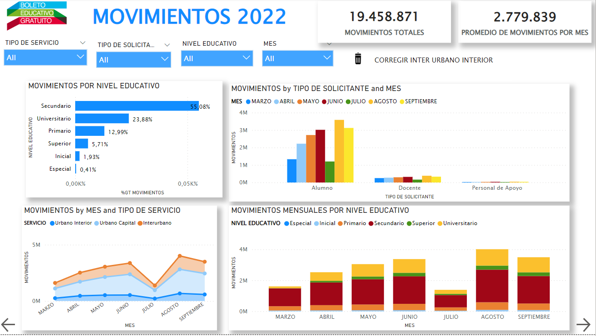
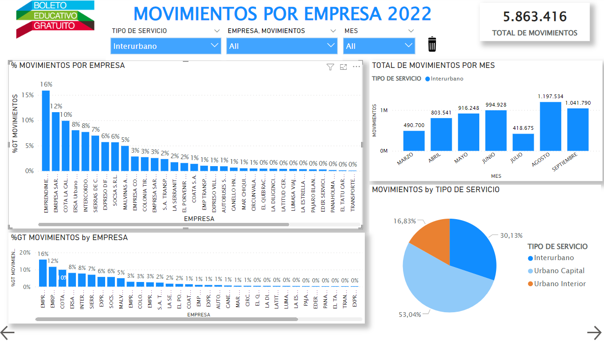
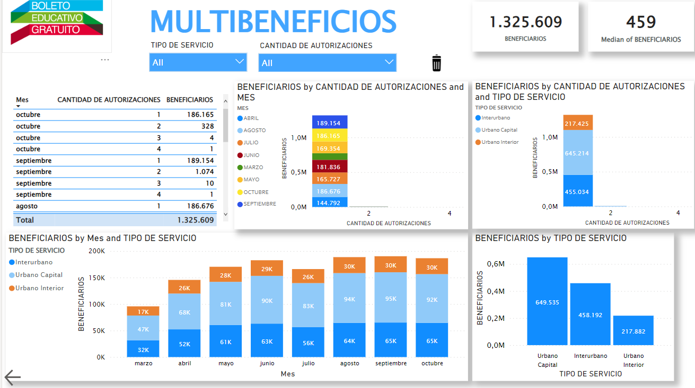
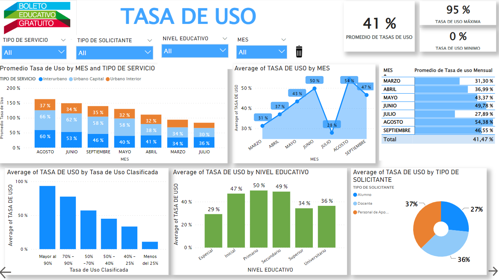

# Public-Transport

This is a proyect I been working of *Public Transport*

**First, I create an index:**

**1. Tab of Movemnts:**

Here are the global transport movements according to bus distance classification

**2. Movement Table by Company**

**3. Movement Table by Company**

**4. Multi-benefits Table**

**5. Usage Rate Table**

