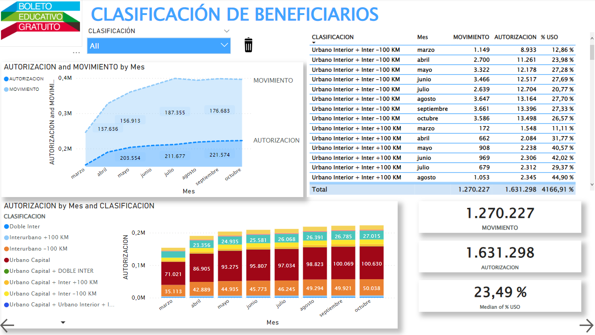

# Public-Transport

This is a proyect I been working of *Public Transport*

**First, I create an index:**

**1. Tab of Movemnts:**

Here are the global transport movements according to bus distance classification

**2. Movement Table by Company**

**3. Beneficiaries**

**4. Multi-benefits Table**

**5. Usage Rate Table**

https://app.powerbi.com/reportEmbed?reportId=44280021-4dde-4b35-8476-7b0890bb55a3&autoAuth=true&ctid=f77e0d0a-5a06-46e7-88fd-6429c8029bac
